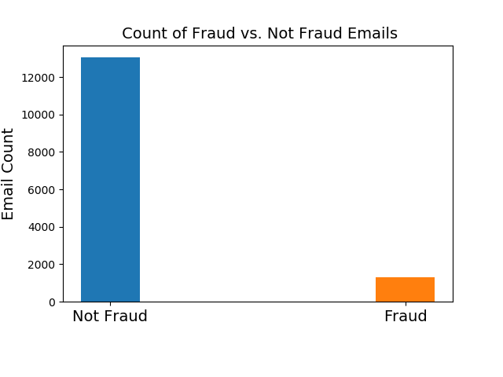
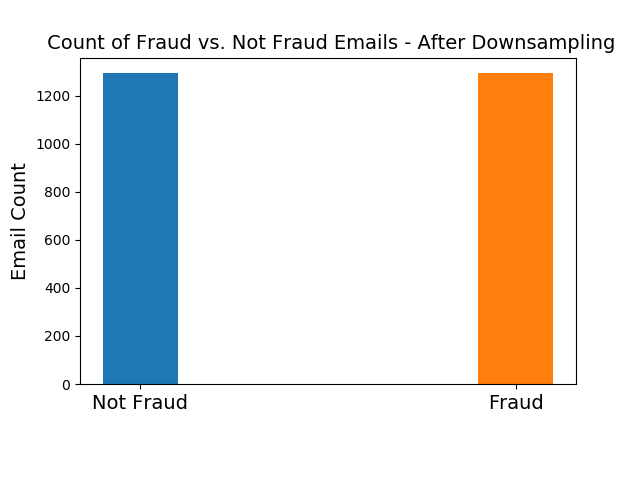
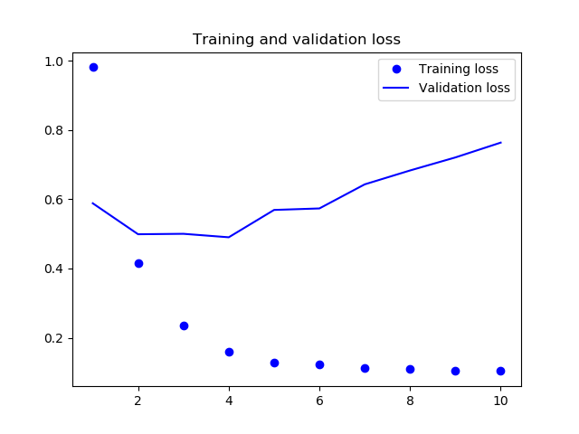
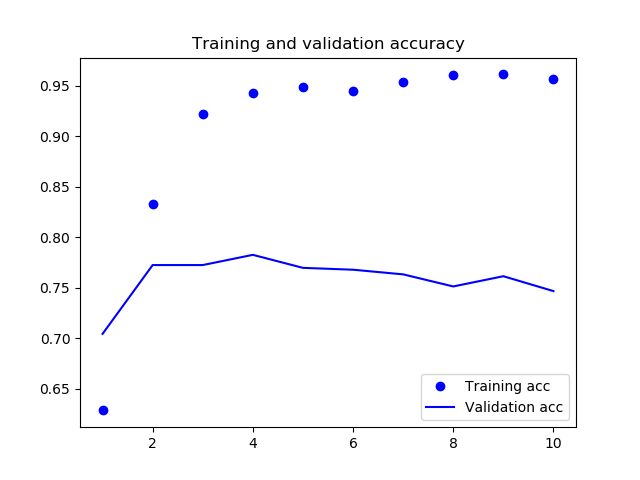

# Classifying Fraud

For a case study we had, we were tasked with predicting if an email is fraud or not fraud. Each observation of the data set represented and email, and there were 44 features associated with each email. The features were things like:

* account type
* country
* email domain
* length of email
* body of email

A target column was created based on the account type column. If 'fraud' was anywhere within the account type, then the email was classified as fraud (1 = fraud, 0 = not fraud).

### Class Imbalance

From the bar graph below, we can see there are many more cases of emails not being fraud compared to those being fraud.



**After downsampling, we have balanced data, and our model can predict more accurately**




### Prepare the Data

I wanted to strictly focus on the language of the email to determine if the email was fraud or not fraud. To do this, I created a data frame with only two columns: the email description and the targets (1 if fraud, 0 if not fraud). The description was in html notation, so I used BeautifulSoup to parse the html into more readable notation.

Once the text was in a more usable form, I was able to use word embeddings to represent the text. Rather than using a pre-trained embedding model, I used an embedding layer, and the word vectors are able to be learned from the training data.

### Defining the Model

For this particular problem, I wanted to use deep learning. I used Tensorflow as a backend to the Keras library in Python. I used some architecture from Francois Chollet's *Deep Learning with Python* for this project. The bulk of the model is here:

```python
# define the model
model = Sequential()
model.add(Embedding(max_words, embedding_dim, input_length=maxlen))
model.add(Flatten())
model.add(Dense(32, activation='relu'))
model.add(Dense(1, activation='sigmoid'))
model.summary()

# compile, train, and evaluate
model.compile(optimizer='rmsprop',
                loss='binary_crossentropy',
                metrics=['acc'])
history = model.fit(x_train, y_train,
                    epochs=10,
                    batch_size=32,
                    validation_data=(x_val, y_val))
```

The Embedding layer can be looked as a dictionary that maps integer indices (which represent words) to dense vectors. It takes the integers as input, and returns the associated dense vectors. So each word is represented as a dense vector. The neural network can recognize and extract patterns based on the dense vectors, which makes it efficient at predicting if a particular email will be fraud or not fraud.

### Results





We can see the model is overfitting, but the accuracy ends up being right around 75%, which isn't too bad. 
